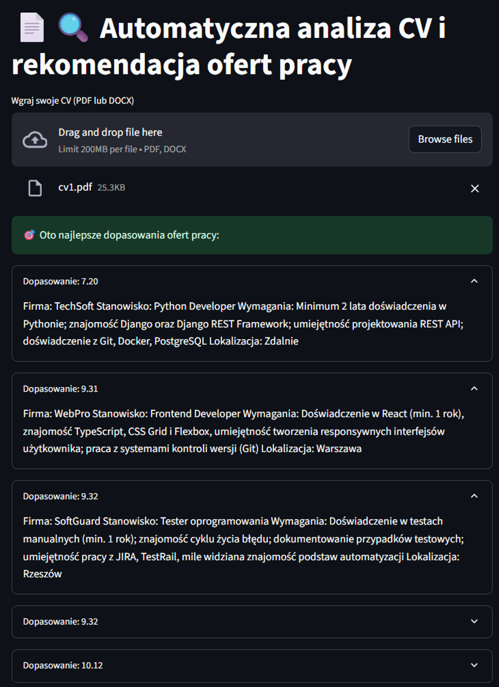
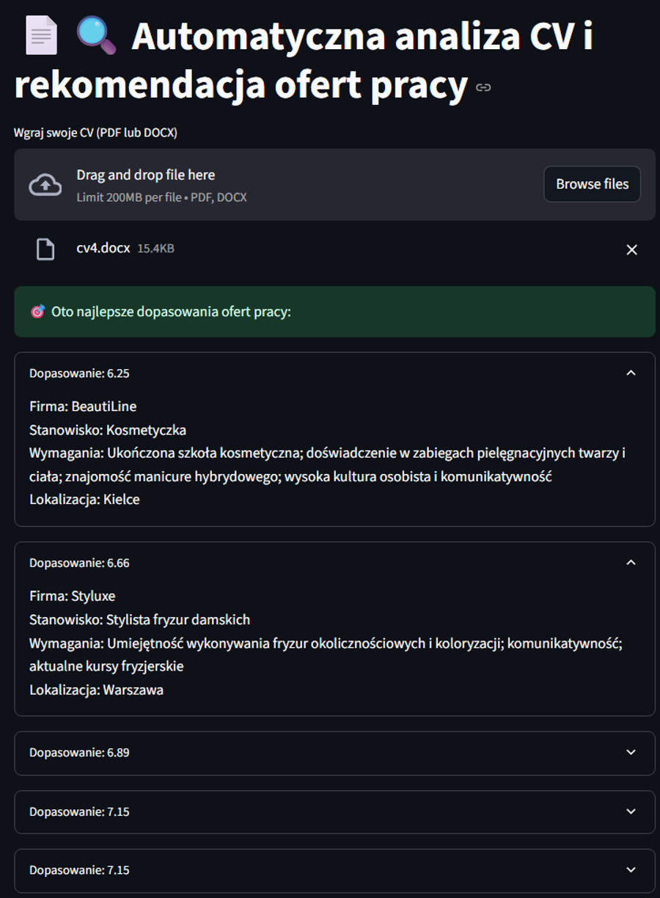

## Job Recommender

## Automatyczna analiza CV i rekomendacja ofert pracy.

Ten projekt pozwala wgrać CV (PDF lub DOCX) i otrzymać najlepsze dopasowania ofert pracy na podstawie analizy semantycznej.

## Funkcjonalności

- Parsowanie CV w formatach PDF i DOCX  
- Analiza treści CV i rekomendacja ofert pracy  
- Wersja CLI ("app.py") i webowa ("web.app.py" z Streamlit)  
- Wektoryzacja ofert pracy przy użyciu Sentence Transformers i FAISS 

## Przykład działania

## CV programisty
Po wgraniu CV programisty aplikacja pokazuje najlepsze dopasowania ofert IT:

## CV kosmetyczki
Po wgraniu CV kosmetyczki aplikacja pokazuje oferty w branży beauty:

